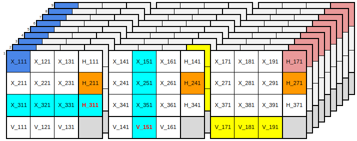
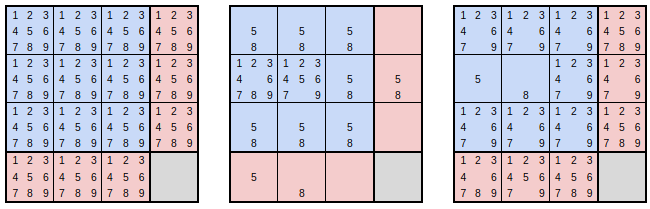
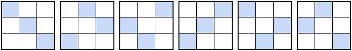
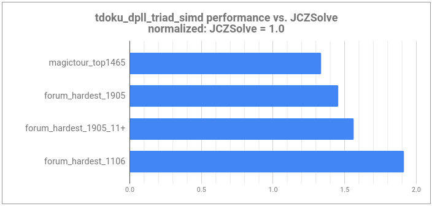

---
header-includes:
    <script async src="https://www.googletagmanager.com/gtag/js?id=UA-142101488-1"></script>
    <script>
      window.dataLayer = window.dataLayer || [];
      function gtag(){dataLayer.push(arguments);}
      gtag('js', new Date());
      gtag('config', 'UA-142101488-1');
    </script>
---

<link type="text/css" rel="stylesheet" href="jquery.tocify.css" />
<link type="text/css" rel="stylesheet" href="bootstrap.min.css" />

<script src="jquery.min.js"></script>
<script src="jquery-ui.min.js"></script>
<script src="jquery.tocify.js"></script>
<script>$(function() { $("#toc").tocify(); });</script>
<script type="text/x-mathjax-config"> 
    MathJax.Hub.Config({ 
        "HTML-CSS": { scale: 110, linebreaks: { automatic: true } }, 
        SVG: { linebreaks: { automatic:true } }, 
        displayAlign: "left" });
</script>

<div id="toc" class="tocify"></div>              
<div class="main-container">


## [Nerd Sniped](https://xkcd.com/356/): A Sudoku Story
Who doesn't love [Sudoku](https://en.wikipedia.org/wiki/Sudoku)? 

Judging from the number of websites, apps, and books on the topic, lots of people love it; judging
from the profusion of here's-my-Sudoku-solver blog posts (like this one), programmers
love it too; and judging from the academic attention it has recieved, computer scientists and ML
researchers love it just as much as everyone else.

I've been known to pass time with Sudoku. Maybe too much time. So, like many before, I've
tried to replace time spent solving Sudokus puzzles with time spent writing a Sudoku solver and in 
so doing have wasted more of it than ever. 

Sudoku has been famously described as a
[denial of service attack on the human intellect](http://norvig.com/sudoku.html).

I feel it keenly.

Still, this has been an enjoyable project with a nice result. I hope you'll enjoy it too; 
I hope it adds something fresh to the Sudoku blogging genre; and, of course, I hope it
contributes to reducing the carbon footprint and data center costs of the burgeoning 
Sudoku puzzle mining industry.

## Defining our Terms

You know the rules, but I'll summarize to define some terms.
 
The Sudoku puzzle is posed as a partially completed 9x9 grid comprising 81 <b>cells</b>.
It is further divided into 9 3x3 subgrids which we'll call <b>boxes</b>. Each row, column,
and box forms a <b>group</b> of 9 cells that obeys an exactly-one constraint.
That's to say that each digit 1-9 must occur once and only once within each group. 
The union of 3 horizontally or vertically adjacent boxes is a <b>band</b>. A set of 3
horizontally or vertically adjacent cells *within* a box is an <b>intersection</b> (of a box
with a row or column). There are 27 groups, 6 bands, and 54 intersections. The given values
are <b>clues</b>.

Elsewhere in Sudoku-land you may see various synonyms for boxes (squares or regions), groups 
(units or houses), or bands (chutes, stacks, towers, or floors), but box, group, and band are 
the terms I'll use here.

## The Really Basic Solver

This is a long story, but it begins with a simple thing: a depth-first search where in each recursive
call we pick an unassigned cell and try to complete the puzzle for each candidate digit
locally consistent with the puzzle's current partial assignment.

To help with determination of local consistency, we'll keep some extra state beyond the 
array of characters representing digits currently placed. It'll be convenient to keep an integer
for each of the 27 groups. The integers serve as bitvectors where a 1 in the $i$th bit position indicates 
that digit $i$ remains to be placed in the group and a 0 indicates that digit $i$ has already been placed
in the group. 

We'll consume our input as a row-major 81 character string containing digits for given clues and 
periods for blank cells like so:

  <pre>5.....37....6..............7..54.....4......2...1..6...6..83........2.4...1......</pre>

For each cell containing a clue we'll begin by clearing the appropriate bit in each of the 
cell's three groups to indicate that the value has already been used, and we'll further initialize
a todo list of empty cells. 

Our state variables and this initialization look like so:

```cpp
constexpr uint32_t kAll = 0x1ff;  // 9 bits
typedef tuple<int, int, int> RowColBox;

array<uint32_t, 9> rows_{}, cols_{}, boxes_{};
vector<RowColBox> cells_todo_;
size_t num_todo_ = 0, num_guesses_ = 0;

void Initialize(const char *input, char *solution) {
    rows_.fill(kAll); 
    cols_.fill(kAll); 
    boxes_.fill(kAll);
    num_guesses_ = 0;
    
    // copy initial clues to solution; todo list won't include these cells
    memcpy(solution, input, 81); 
    cells_todo_.clear();

    for (int row = 0; row < 9; ++row) {
        for (int col = 0; col < 9; ++col) {
            int box = (row / 3) * 3 + col / 3;
            if (input[row * 9 + col] == '.') {
                // blank cell: add to the todo list
                cells_todo_.emplace_back(make_tuple(row, col, box));
            } else {
                // a given clue: clear availability bits for row, col, and box
                uint32_t value = 1u << (uint32_t) (input[row * 9 + col] - '1');
                rows_[row] ^= value;
                cols_[col] ^= value;
                boxes_[box] ^= value;
            }
        }
    }
    num_todo_ = cells_todo_.size() - 1;
}
```

With the setup out of the way, our recursive function to solve the puzzle looks like this:

```cpp
// Returns true if a solution is found, updates *solution to reflect assignments
// made on solution path. Also updates num_guesses_ to reflect the number of 
// guesses made during search.
bool SatisfyGivenPartialAssignment(int todo_index, char *solution) {
    int [row, col, box] = cells_todo_[todo_index];

    auto candidates = rows_[row] & cols_[col] & boxes_[box];
    while (candidates) {
        uint32_t candidate = GetLowBit(candidates);

        // only count assignment as a guess if there's more than one candidate.
        if (candidates ^ candidate) num_guesses_++;

        // clear the candidate from available candidate sets for row, col, box 
        rows_[row] ^= candidate;
        cols_[col] ^= candidate;
        boxes_[box] ^= candidate;

        // recursively solve remaining todo cells and back out with the solution. 
        if (todo_index == num_todo_ || 
            SatisfyGivenPartialAssignment(todo_index + 1, solution)) {
            board[row * 9 + col] = (char) ('1' + LowOrderBitIndex(candidate));
            return true;
        }
        
        // restore the candidate to available candidate sets for row, col, box 
        rows_[row] |= candidate;
        cols_[col] |= candidate;
        boxes_[box] |= candidate;

        candidates = ClearLowBit(candidates);
    }
    return false;
}
```
With the code above in a struct called SolverBasic, we'll put it all together like [so](https://github.com/t-dillon/tdoku/blob/master/src/solver_basic.cc):

```cpp
bool SolveSudoku(const char *input, char *solution, size_t *num_guesses) {
    static SolverBasic solver;
    solver.Initialize(input, solution);
    bool found_solution =  solver.SatisfyGivenPartialAssignment(0, solution);
    *num_guesses = num_guesses_;
    return found_solution;s
}
```
This is the sort of thing you might write to solve a problem on [Leetcode](https://leetcode.com/problems/sudoku-solver/).

We could stop here and our puzzles would be satisfied.

But would we be satisfied? Is this fast? Let's see ...

## Measuring Performance

If you only look at performance on really easy puzzles like those found in this
[Kaggle data set](https://www.kaggle.com/bryanpark/sudoku), then you might say yes, this solver is
actually fast! Here's how its performance on this dataset compares[^1] to
[JCZSolve](http://forum.enjoysudoku.com/3-77us-solver-2-8g-cpu-testcase-17sodoku-t30470-210.html#p249309), 
which is the fastest Sudoku solver I'm aware of:

|puzzles0_kaggle                       |  puzzles/sec|  usec/puzzle|   %no_guess|  guesses/puzzle|
|--------------------------------------|------------:| -----------:| ----------:| --------------:|
|jczsolve                              |   595,697.0 |         1.7 |     100.0% |           0.00 |
|tdoku_basic                           |   587,632.6 |         1.7 |       0.0% |          32.90 |

[^1]: All benchmarks run on i5-8600k@3.6GHz; clang++-8 -O3 -mavx2 -march=native; Ubuntu 18.04 using benchmark program found [here](https://github.com/t-dillon/tdoku/blob/master/src/run_benchmark.cc)

588 kps is right up there! Do we have a contender?  

Certainly not. All this serves to show is that the choice of benchmark matters a lot. The 
puzzles in the Kaggle dataset are too easy to present an interesting challenge to humans
or machines. They have an average of 35 clues per puzzle, many more than the typical Sudoku, and as
a result each puzzle has many easy routes to a solution. Any solver will be fast on such puzzles,
and JCZSolve is designed for much harder work.

For a look at a dataset that's more of a challenge for the basic solver, consider the list of ~49,000
[17 Clue Puzzles](http://staffhome.ecm.uwa.edu.au/~00013890/sudokumin.php) maintained by Gordon Royle 
of the University of Western Australia:

|puzzles1_17_clue                      |  puzzles/sec|  usec/puzzle|   %no_guess|  guesses/puzzle|
|--------------------------------------|------------:| -----------:| ----------:| --------------:|
|jczsolve                              |   318,424.5 |         3.1 |      69.6% |           1.25 |
|tdoku_basic                           |         3.9 |   254,036.0 |       0.0% |   9,803,916.52 |

At a pathetic 3.9 puzzles per second and 9.8 million guesses per puzzle our basic solver is not 
looking so fast anymore.

At first glance you might guess that these 17 clue puzzles would be among the hardest Sudoku since the 
puzzle solver is given so little to work with. However, it turns out that while they're particularly
difficult for our basic solver, they're actually among the easiest Sudoku for solvers that incorporate
additional reasoning techniques or that start from a slightly different representation. 
Since 17 is the bare minimum number of clues required to constrain a Sudoku puzzle to a single
solution, these clues will necessarily have a high degree of orthogonality, and this usually leads to
many trivial consequences. Employing *nothing* but the most elementary Sudoku solving technique 
(that of [naked](http://sudopedia.enjoysudoku.com/Naked_Single.html) and
[hidden singles](http://sudopedia.enjoysudoku.com/Hidden_Single.html)) one can
solve 45% of 17-clue puzzles (i.e., a chain of trivial consequences leads to the entire solution).
Only 0.07% of 17 clue puzzles lack an immediate opportunity to make some progress in this way.

I'd like a solver that's fast on the hardest puzzles. 
What, then, makes a hard puzzle? This is an interesting question whose answer depends
in part on the solver we have in mind. Do we mean hard for a human? Hard for a specific 
algorithm? There's been plenty of work on these questions, but I won't delve into it.
Fortunately there's an active community of Sudoku enthusiasts who search for hard puzzles, rate
their difficulty in various ways, and curate lists of the very hardest puzzles. For the rest of this
post we'll rely on these lists in evaluating solver performance.

In particular, we'll use four datasets in order of increasing difficulty:

   1. [Magic Tour Top 1465](http://magictour.free.fr/sudoku.htm): 
       An old list of 1465 hard puzzles that's been used as a common benchmark
       (hard, but not among the hardest by modern standards).
   1. [Player's Forum Hardest (1905)](http://forum.enjoysudoku.com/the-hardest-sudokus-new-thread-t6539-600.html#p277835): 
       A list of over 2 million hard puzzles maintained by members of the Enjoy Sudoku players forum
       (see ph_1905.zip from the Google Drive link).
   1. The subset of [Player's Forum Hardest (1905)](http://forum.enjoysudoku.com/the-hardest-sudokus-new-thread-t6539-600.html#p277835)
      list having a Sudoku Explainer difficulty rating above 11.0 (coincidentally also about 49,000 puzzles).
   1. [Player's Forum Hardest (1106)](http://forum.enjoysudoku.com/the-hardest-sudokus-new-thread-t6539.html#p65791):
      The list of 376 puzzles that originally kicked off the linked player's forum hardest puzzle thread, and which 
      seems to contain on average the hardest puzzles of all for the solvers we test.
      
Tests on these datasets corroborate what we learned from the 17 clue puzzles. Our basic solver is 
not fast at all on difficult puzzles, and it does an excessive amount of guessing and backtracking
(although it does better with these than it did with the 17 clue puzzles -- the 17 clue puzzles are
especially pathological for it for reasons we'll discuss below). JCZSolve itself slows down quite
a bit and does more guessing as we go from the easiest to the hardest of these datasets. 

|puzzles2_magictour_top1465            |  puzzles/sec|  usec/puzzle|   %no_guess|  guesses/puzzle|
|--------------------------------------|------------:| -----------:| ----------:| --------------:|
|jczsolve                              |   123,779.7 |         8.1 |       2.3% |          12.53 |
|tdoku_basic                           |        43.7 |    22,866.1 |       0.0% |     909,286.96 |

|puzzles3_forum_hardest_1905           |  puzzles/sec|  usec/puzzle|   %no_guess|  guesses/puzzle|
|--------------------------------------|------------:| -----------:| ----------:| --------------:|
|jczsolve                              |    30,678.3 |        32.6 |       0.0% |          73.29 |
|tdoku_basic                           |       365.9 |     2,733.0 |       0.0% |      94,664.81 |

|puzzles4_forum_hardest_1905_11+       |  puzzles/sec|  usec/puzzle|   %no_guess|  guesses/puzzle|
|--------------------------------------|------------:| -----------:| ----------:| --------------:|
|jczsolve                              |    24,054.3 |        41.6 |       0.0% |          89.94 |
|tdoku_basic                           |       277.8 |     3,599.4 |       0.0% |     125,027.95 |

|puzzles5_forum_hardest_1106           |  puzzles/sec|  usec/puzzle|   %no_guess|  guesses/puzzle|
|--------------------------------------|------------:| -----------:| ----------:| --------------:|
|jczsolve                              |    12,782.2 |        78.2 |       0.0% |         188.69 |
|tdoku_basic                           |       103.8 |     9,630.4 |       0.0% |     344,814.26 |

Cleary to improve on the performance of our basic solver we're going to have reduce the amount of
guessing. We're doing orders of magnitude more of it than JCZSolve, and this is not at all in the
spirit of human puzzle solving, where we prefer not to guess at all. Let's see  what we can do.

## The Low Hanging Fruit

Somewhere in any presentation on constraint solving is a discussion of the impact of variable 
ordering on backtracking efficiency. Before Peter Norvig ever wrote a [Sudoku solver](https://norvig.com/sudoku.html) 
he first wrote [the book](http://aima.cs.berkeley.edu/), and you can read all about it there. So far we've paid 
no heed to which cell we're assigning next, and an obvious heuristic if we're going to be more deliberate
about it is to pick from among the most constrained cells (i.e., those with the fewest remaining 
candidates) in order to reduce the effective branching factor of our search.

To achieve this, we'll add two functions and stick a call to MoveBestTodoTofront() at the top 
of SatisfyGivenPartialAssignment():

```cpp
int NumCandidates(const RowColBox &row_col_box) {
    int [row, col, box] = cells_todo_[todo_index];
    auto candidates = rows_[row] & cols_[col] & boxes_[box];
    return NumBitsSet(candidates);
}

void MoveBestTodoToFront(int todo_index) {
    nth_element(cells_todo_.begin() + todo_index,
                cells_todo_.begin() + todo_index,
                cells_todo_.end(),
                [&](const RowColBox &cell1, const RowColBox &cell2) {
                    return NumCandidates(cell1) < NumCandidates(cell2);
                });
}
```

This simple change leads to a dramatic improvement. Let's compare on just one dataset:

|puzzles2_magictour_top1465            |  puzzles/sec|  usec/puzzle|   %no_guess|  guesses/puzzle|
|--------------------------------------|------------:| -----------:| ----------:| --------------:|
|jczsolve                              |   123,779.7 |         8.1 |       2.3% |          12.53 |
|tdoku_basic                           |        43.7 |    22,866.1 |       0.0% |     909,286.96 |
|tdoku_basic_heuristic                 |     1,483.9 |       673.9 |       0.0% |         329.01 |

With a speedup of ~30x and a reduction in guessing of ~1/3000x, this is a big step in the right 
direction. If this sounds like a surprisingly large improvement, consider that the most constrained
cell in the todo list might have no remaining candidates, in which case we'll backtrack immediately
where previously we might have exhaustively explored assignments for multiple other variables before
reaching the same conflict on each branch. The most constrained cell in the todo list might also 
have just one candidate, in which case we'll immediately propagate that value as a consequence
of prior assignments, which may in turn lead to other single-candidate cells and further propagation.
And if neither of these cases obtain, then we'll still pick the cell with the lowest current branching
factor.

Now, despite all this our heuristic basic solver is still very slow and it still does quite a bit
more guessing than JCZSolve. Before really trying to optimize for performance let's look harder at 
why we do all this guessing and what we can do to reduce it.
 
If you have experience in constraint solving and you think about code we've written so far, your
reaction may be "that's crypto-DPLL", and so it is. Let's uncover this algorithm and see where it leads.

## Getting Propositional

If you've read this far, I'll assume some basic familiarity with propositional logic. 
Suppose $x_{rcv}$ is a variable expressing that the cell at row $r$ and column $c$
contains the digit $v$, <i>D</i> is the set { 1,2,3,4,5,6,7,8,9 }, and R(<i>i,j</i>) and
C(<i>i,j</i>) are functions returning the row and column respectively of the <i>j</i>th cell
in the <i>i</i>th box. A minimal CNF formula representing the rules of Sudoku is a conjunction 
of the following clauses:

<b>Each cell contains a value</b>  (81 positive clauses, 9 literals each)
$$ \forall_{r,c \in D} \, (x_{rc1} \lor x_{rc2} \lor x_{rc3} \lor x_{rc4} \lor x_{rc5} \lor x_{rc6} \lor x_{rc7} \lor x_{rc8} \lor x_{rc9})  $$

<b>No cell contains more than one value</b>  (<small>$81\binom{9}{2}=2916$</small> binary constraint clauses)
$$ \forall_{r,c,i,j \in D, \,i < j} \, (\lnot x_{rci} \lor \lnot x_{rcj}) $$ 

<b>No row|col|box contains the same value twice</b>  (<small>$3 \times 81\binom{9}{2}=8748$</small> binary constraint clauses)
$$ \forall_{r,v,i,j \in D, \,i < j} \, (\lnot x_{riv} \lor \lnot x_{rjv}) $$ 
$$ \forall_{c,v,i,j \in D, \,i < j} \, (\lnot x_{icv} \lor \lnot x_{jcv}) $$ 
$$ \forall_{b,v,i,j \in D, \,i < j} \,
 (\lnot x_{\mathrm{R}(b,i)\mathrm{C}(b,i)v} \lor \lnot x_{\mathrm{R}(b,j)\mathrm{C}(b,j)v}) $$ 

These 11745 clauses capture the constraints that are common to all Sudoku puzzles. In order to
express the additional constraints of a specific puzzle we add a unit clause for each of the
given clues. For example, to represent the previous sample input:

  <pre>5.....37....6..............7..54.....4......2...1..6...6..83........2.4...1......</pre>

We add these unit clauses:

$$(x_{115}) \land (x_{173}) \land (x_{187}) \land (x_{246}) \land (x_{417}) \land
(x_{445}) \land (x_{454}) \land (x_{524}) \land (x_{592}) \land (x_{641}) \land \\
(x_{676}) \land (x_{726}) \land (x_{758}) \land (x_{763}) \land (x_{862}) \land
(x_{884}) \land (x_{931})$$

With our problem expressed as a propositional formula in CNF we can now turn to DPLL for a solution. 
What is DPLL?  The [Davis-Putnam-Logemann-Loveland](https://en.wikipedia.org/wiki/DPLL_algorithm) 
algorithm is the Kevin Bacon of satisfiability. There are shinier things, but he's been around 
for a long time, everyone has worked with him, and in the right role he still gets the job done.
([Duck](https://www.youtube.com/watch?v=ooH3e1tD91E) anyone?)  DPLL determines whether a CNF
formula, <small>$F$</small>, is satisfiable (and finds a satisfying truth assignment) by pairing 
search with restricted constraint propagation in the form of unit resolution. In a nutshell, the
algorithm is this:

<div class="math-left-align">
$$\textrm{DPLL}(F)\textrm{:} \\
\quad\,\, F \leftarrow \textrm{unit-propagate}(F) \\
\quad\,\, \textrm{if (contains-empty-clause}(F)) \, \textrm{return UNSAT}\\
\quad\,\, \textrm{if (contains-consistent-interpretation}(F)) \, \textrm{return SAT}\\
\quad\,\, lit \leftarrow \textrm{choose-literal-to-branch}(F)\\
\quad\,\, \textrm{return DPLL}(F \land \{lit\}) \lor \textrm{DPLL}(F \land \{\lnot lit\})$$
</div>

If you squint at it hard enough, you'll see that the behaviour of our heuristic simple solver is 
the same as that of DPLL. Its representation of clauses is implicit rather than explicit, but it 
does return false when there are no candidates for a cell (when the cell's positive clause has
become empty); it does return true when a satisfying assignment for all cells is found; it does do unit
propagation (if the last assignment caused another cell to have just one candidate then this
cell will be processed next); and it does effectively branch on literals 
(since cell values are mutually exclusive asserting the next candidate is the same as negating
the first and then choosing another literal to branch). Given this correspondence, in what follows
we'll abandon the crypto-DPLL and speak in terms of DPLL directly.

Now the core of DPLL, and the key to understanding its limitations, is the unit 
propagation step, so let's examine this more closely.

Recall the resolution rule in propositional logic, which says we can take a pair of clauses, 
one containing a literal $x$ and the other containing its negation $\lnot x$, and combine them to
produce a third clause, the resolvent, containing the union of the literals in the first two clauses
minus the complementary literals resolved upon.

To motivate this, we can take an arbitrary pair of resolvable input clauses:

$(\,\,x \lor y_1 \lor \ldots \lor y_n) \\
(\lnot x \lor z_1 \lor \ldots \lor z_n)$

And rewrite them as implications:

$\lnot x \rightarrow (y_1 \lor \ldots \lor y_n) \\
\,\, x \rightarrow (z_1 \lor \ldots \lor z_n)$

By the law of the excluded middle we know we must have $(\lnot x \lor x)$, so we must have one or the other
of these consequences:

$(y_1\lor \ldots \lor y_n) \lor (z_1 \lor \ldots \lor z_n)$

Which we can write simply as:

$(y_1\lor \ldots \lor y_n \lor z_1 \lor \ldots \lor z_n)$

Resolution gives us a sound procedure for finding consequences, and if we exhaustively perform
all possible resolutions we'll eventually find all consequences, including the puzzle solution
in the form of a unit clause for each cell. This will do away with the need for any search, guessing, or
backtracking, but it will also produce a fantastic number of consequences along the way, most of
which are not required in the resolution derivation of our solution; our solver will be slow.

Going in the other direction, we've already seen with our first basic solver that if we omit constraint
propagation and just perform search then we wind up with a truly excessive amount of guessing and
backtracking; again our solver will be slow.

The winning compromise of DPLL is to use constraint propagation to prune the search tree, but to
restrict the inference done during constraint propagation to keep it bounded and fast, if incomplete.
In particular, in the constraint propagation step of DPLL we perform resolution, but we confine 
ourselves to resolutions between pairs of clauses where at least one of the parent clauses is a 
unit clause (i.e., a literal already known to be asserted). Since the resolvent in this case always
subsumes its non-unit parent, the size of our formula can only shrink. This nicely bounds the cost of
constraint propagation, but it does mean we'll fail to find any consequences not reachable via
unit resolution.

To illustrate a consequence we won't find, after unit propagation the first row of a puzzle might
have the following assigned cells and remaining candidates in unassigned cells:

<center></center><br>

It will be obvious to a human player that the solutions to the cells in the center and on the right
are 2 and 8 respectively because these are hidden singles; but this conclusion can not be reached 
via unit resolution from our starting formula simply because there are no unit clauses to work
with. The clauses relevant to the deductions we want to make are all binary constraint clauses or
positive cell clauses that now contain 2, 3, or 4 literals.

Fortunately there's an easy fix for this specific problem. All we need to do is add some new positive
clauses that are group-aligned instead of cell-aligned:

<b>Each row contains each value in some column</b>  (81 positive clauses, 9 literals each)
$$ \forall_{r,v \in D} \, (x_{r1v} \lor x_{r2v} \lor x_{r3v} \lor x_{r4v} \lor x_{r5v} \lor x_{r6v} \lor x_{r7v} \lor x_{r8v} \lor x_{r9v})  $$

<b>Each column contains each value in some row</b>  (81 positive clauses, 9 literals each)
$$ \forall_{c,v \in D} \, (x_{1cv} \lor x_{2cv} \lor x_{3cv} \lor x_{4cv} \lor x_{5cv} \lor x_{6cv} \lor x_{c7v} \lor x_{8cv} \lor x_{9cv})  $$

<b>Each box contains each value in some cell</b>  (81 positive clauses, 9 literals each)
$$ \forall_{b,v \in D} \, (x_{R(b,1)C(b,1)v} \lor x_{R(b,2)C(b,2)v} \lor \ldots \lor x_{R(b,8)C(b,8)v} \lor x_{R(b,9)C(b,9)v})  $$

Armed with these new positive clauses unit resolution can discover and propagate hidden
singles since these clauses will become unit clauses when only one candidate remains in a group.

In a sense these clauses haven't added anything new. They are all logical consequences of the 
clauses we started with, and we could derive a resolution proof for each of them if we were
patient. That said, we know these new clauses are consequences of the set we started with not 
because of resolution proofs, but because of the pigeonhole principle. And since the shortest
resolution proof of a pigeonhole formula is exponential in the number of variables 
[[Haken 1985](https://www.sciencedirect.com/science/article/pii/0304397585901446)], these
new clauses are, in a sense, very very far away from our starting point. It's therefore no
surprise that puzzles which require them (e.g., 17 clue puzzles) are very difficult for solvers 
that are not designed to take advantage of them.

Note that we might easily have included these clauses from the start. They are, after all, the positive side of
the "exactly one" rule. The main reason why we didn't is that we started by thinking not in terms of
clauses and literals, but in terms of an implementation focused on cells and their candidates. This
makes it natural to consider only the positive clauses representing candidates for a cell, not those
that go across cells. It is probably also why many Sudoku solvers treat naked singles and hidden 
singles as different things, if they take hidden singles into consideration at all.

## The Tseytinesque Transformation

While the cost of unit propagation is bounded by the number and size of the clauses in our formula, 
we've just seen that this doesn't mean we want to strictly minimize the size of this formula. It can
be quite useful to add clauses that are tautologically implied if they make consequences 
reachable via unit resolution that were not reachable before.

This raises an important question: what other clauses would it help to add?

There exist a range of knowledge compilation techniques whose purpose is to augment a logical 
formula with consequences found during an offline analysis phase so that the augmented formula
supports complete inference with respect to a tractable procedure like unit resolution 
[[Cadoli 1997](https://www.semanticscholar.org/paper/A-Survey-on-Knowledge-Compilation-Cadoli-Donini/0fedcf2779f31ced9f147252bb6c454f5186a9f5)].
If it were feasible for Sudoku we'd be happy to exchange an expensive one-time compilation for a
representation that gives us fast and complete inference while puzzle solving. Unfortunately,
judging just from the pigeonhole issues already discussed, it is almost certainly infeasible perform 
such a compilation for Sudoku, or it would produce a compiled theory much too large to be practical.

However, a key insight discussed in [[del Val 1994](https://pdfs.semanticscholar.org/3fb6/f637a74ef2b694e8aceb61e876331a599a94.pdf)]
is that the incompleteness of unit resolution is tied to the occurrence of merges in resolution
proofs. By a <b>merge</b> we mean a case where the resolvent contains one or more literals that 
occurred in both parent clauses, as in the following example where we have a merge on <i>b</i>.

$$ \frac{(\,\,a \lor b \lor c) \land (\lnot a \lor b \lor d)}{(b \lor c \lor d)} $$

This observation motivates del Val's compilation technique which augments a CNF formula with
a subset of its merge prime implicates in a way that guarantees all other prime implicates can be
reached during a unit resolution refutation.

Following this line of thinking, if we're looking for clauses that would be useful to add to our
Sudoku formula we should start by looking for common consequences that arise via merge resolutions.
Where, then, can merges arise?

They can *not* arise from any combination of binary constraint clauses exclusively. These clauses
contain only negative literals and produce no resolutions on their own.

They can *not* arise from the conjunction of binary constraint clauses and any single positive cell clause.
A non-tautological resolution involving the positive cell clause exchanges one of its positive 
literals for a negative literal of the *same value* in a different cell. Since the possible
substitutions for each positive literal are all disjoint, again no merges can occur.

However a merge _can_ arise from the conjunction of binary constraint clauses and any of the *group* 
positive clauses that we added to support hidden singles.

For example, if we start from the clause asserting there's a one in the first row and assume that
we've eliminated the possibility of a one in all cells except the intersection with the first
box, then we're left with what we'll call a <b>triad</b>: a disjunction over three literals 
for the *same value* in an *intersection*:

$$ (x_{111} \lor x_{121} \lor x_{131}) $$

Looking at the first cell on the second row, we have among our binary constraints these clauses:

$$ (\lnot x_{111} \lor \lnot x_{211}) $$
$$ (\lnot x_{121} \lor \lnot x_{211}) $$
$$ (\lnot x_{131} \lor \lnot x_{211}) $$

A series of merge resolutions between these clauses results in the unit consequence that the cell
on the second row can not contain a one:

$$ (\lnot x_{211}) $$

In Sudoku circles the situation described above is known as a "locked candidate". i.e., we don't
know which cell contains the candidate, but we do know that it's one of the three cells in
the intersection, and therefore the candidate can be excluded from any other cells in the groups
that contain the intersection. I don't know if locked candidates play an especially important role
in human puzzle solving relative to the many other puzzle solving techniques, but their 
consideration of does appear to play an important role in fast sudoku solvers. They probably have
a large payoff precisely because they are the simplest and most common cases where merge 
resolutions arise to thwart unit propagation.

What, then, is the clause we should add to make the inference above available via unit resolution?
In this case it would be:

$$ (x_{141} \lor x_{151} \lor x_{161} \lor x_{171} \lor x_{181} \lor x_{191} \lor \lnot x_{211}) $$

With 54 intersections, 12 cells that pivot around each, and 9 values we would need 5832 clauses
of 7 literals each to represent all cases like this, which seems quite a lot. Adding such a large
number of large clauses would almost triple the size of our formula. Fortunately, there is a
better way.

Observing that the triads we've defined above are common subexpressions between box-oriented positive 
clauses and row or column-oriented positive clauses, we can factor our logic by introducing a new
propositional variable to represent the satisfiability of each triad. We separately define 
horizontal and vertical triads, here indexed respectively by the lowest column or row they contain:

$$ \forall_{r,v \in D, b \in \{1,4,7\}} \,\,\, h_{rbv} \leftrightarrow (x_{r(b+0)v} \lor x_{r(b+1)v} \lor x_{r(b+2)v}) $$
$$ \forall_{c,v \in D, b \in \{1,4,7\}} \,\,\, v_{bcv} \leftrightarrow (x_{(b+0)cv} \lor x_{(b+1)cv} \lor x_{(b+2)cv}) $$

After adding these definitions to our formula we can replace our 9-literal positive row, column, and
box clauses with 3-literal clauses over triads. Further, we can replace most of our group-aligned
binary constraint clauses with binary constraints involving triads.  e.g., we replace an exactly-one
row constraint over cell literals:

$$\,\,\textrm{exactly-one}(x_{r1v} \lor x_{r2v} \lor x_{r3v} \lor x_{r4v} \lor x_{r5v} \lor x_{r6v} \lor x_{r7v} \lor x_{r8v} \lor x_{r9v}) $$

With three exactly-one constraints that define horizontal triads:

$$\,\,\textrm{exactly-one}(x_{r1v} \lor x_{r2v} \lor x_{r3v} \lor \lnot h_{r1v})$$
$$\,\,\textrm{exactly-one}(x_{r4v} \lor x_{r5v} \lor x_{r6v} \lor \lnot h_{r4v})$$
$$\,\,\textrm{exactly-one}(x_{r7v} \lor x_{r8v} \lor x_{r9v} \lor \lnot h_{r7v})$$

And one exactly-one constraint to re-express via triads that we have exactly one value in the row:

$$\,\,\textrm{exactly-one}(h_{r1v} \lor h_{r4v} \lor h_{r7v})$$

This replaces one 9-literal clause and 36 binary clauses with one 3-literal clause, three 4-literal
clauses, and 21 binary clauses.

This procedure is very much like applying a [Tseytin transformation](https://en.wikipedia.org/wiki/Tseytin_transformation)
with the goal not of putting our formula into CNF -- we already have CNF -- but rather to 
eliminate the need for merges. Our new formula has extra nuisance variables that are not
directly a part of our solution, but the overall formula is equisatisfiable with the original, it
is smaller than the original, and it makes more consequences reachable by unit resolution than does
the original.

## Numerical Clauses

The introduction of triads is a nice improvement in our representation, but there is more we can
do with them. So far we've used them to express constraints that act on the *same* value *across* intersections
in a group. We can also use them to express constraints over *different* values *within* the same
intersection. However, to do this it will be convenient to think of clauses and resolution a little
differently.

Previously we justified resolution by converting clauses into implications and showing via the
law of the excluded middle that we must have one or the other of the right hand sides of those
implications. Let's consider another way to motivate it. A disjunction is a way of saying
"at least one of the literals in this set true". Let's generalize this notion and think of a
<i>numerical clause</i> as a bag of literals with a specified minimum that must be true.  We
adopt the following notation:

$(1/ \,\, x \lor y_1 \lor \ldots \lor y_n) \\
(1/ \lnot x \lor z_1 \lor \ldots \lor z_n)$

In the event that the minumum is 1, as shown above, the numerical clause is the same as a normal clause, the
difference between a bag and a set being irrelevant in this case.

Now, if we've got at least <i>n</i> true literals in one bag and at least <i>m</i> true literals
in another, and if we place the contents of the first two bags into a third, then the third bag has at
least <i>n + m</i> true literals:

$(2/ \,\, x \lor y_1 \lor \ldots \lor y_n \lor \lnot x \lor z_1 \lor \ldots \lor z_n)$

If we remove the pair of complementary literals from this new numerical clause we know, again from
the law of the excluded middle, that we are removing exactly one true literal, so we decrement the
minimum by one and we've reached the same resolvent as before:

$(1/ \, y_1 \lor \ldots \lor y_n \lor z_1 \lor \ldots \lor z_n)$

So the numerical clause gives us a way to represent the constraint "at least N of", and it is equipped
a resolution rule for generating new numerical clauses. We can develop other rules for simplifying
and reasoning with numerical clauses, but since we'll be sticking with unit resolution we won't
need anything beyond the obvious: when the number of literals in a numerical clause equals the
clause minimum, then we can assert each of the literals as a unit clause. 

With this tool we now have an easy way to represent and reason about the triad literals in a given
interection.  What we want to say is:

$$ \textrm{exactly-three}(h_{111} \lor \ldots \lor h_{119} )$$

The usual way to express this in CNF would be to add <small>$\binom{9}{7}=36$</small> clauses 
to insist on at least 3 values and <small>$\binom{9}{4}=126$</small> clauses to insist on at most 3
values. Instead, we can write this with just two numerical clauses:

$$ (3/ \,\,\,h_{111} \lor \ldots \lor h_{119} )$$
$$ (6/ \lnot h_{111} \lor \ldots \lor \lnot h_{119} )$$

This is a much more compact and tidy representation, which we appreciate since the cost of unit 
propagation is bounded by the size of our representation, and since our efforts to implement
this efficiently will be intimately tied to our representation.

## The Representational Reward

Enough of the theory for a moment. Let's put this ideas into practice and see how far we've come.

Our next solver will be based on DPLL with literals and numerical clauses as the native representation.
The logic will be organized around triads as discussed above. The diagram below offers a visualization of the
propositional variables involved in a single band and the ways in which literals occur together 
in each type of constraint:



<br>
There's a separate layer in the diagram for the literals for each digit. To help make 
relationships clear each box is depicted separately, containing a 3x3 matrix of cell literals
as well as 3x1 and 1x3 vectors of horizontal and vertical triads. The colored regions indicate
sets of literals that occur together in exactly-N constraints of each type:

   * The blue literals (starting with X_111) form an exactly-one constraint indicating that
     the cell at R1C1 has exactly one value.
   * The reddish triad literals (starting with H_171) form an exactly-three constraint indicating
     that the intersection containing cells R1C7,R1C8,R1C9 has exactly three values.
   * The horizontal row of cyan literals (starting with X_311) form an exactly-one constraint
     establishing the definition of the H_311 triad literal (shown in red to indicate that its
     occurrence in this clause is negative).
   * The vertical row of cyan literals (starting with X_151) form an exactly-one constraint
     establishing the definition of the V_151 triad literal (shown in red to indicate that its
     occurrence in this clause is negative).
   * The horizontal row of yellow literals (starting with V_171) form an exactly-one constraint
     indicating that one and only one of the value one may occur in the box. The vertical column
     of yellow literals in the second layer establishes the same constraint for a different box
     for the value two. Note that these horizontal and vertical within-box constraints are in
     some sense redundent, but still valuable as discussed above.
   * The set of non-contiguous orange literals (starting with H_211) form an exactly-one 
     constraint indicating that one and only one of the value one may occur in the row. Note that
     there are similar constraints oriented vertically across boxes, but they're not shown here
     because we're only looking at one horizontal band.

Note that we have no constraint directly involving all of the cell literals in a row, column, or
box. These constraints are all mediated via triads.

The code for this solver is [here](https://github.com/t-dillon/tdoku/blob/master/src/solver_dpll_triad_scc.cc),
and here are the results.       

|puzzles2_magictour_top1465            |  puzzles/sec|  usec/puzzle|   %no_guess|  guesses/puzzle|
|--------------------------------------|------------:| -----------:| ----------:| --------------:|
|jczsolve                              |   123,779.7 |         8.1 |       2.3% |          12.53 |
|tdoku_basic_heuristic                 |     1,483.9 |       673.9 |       0.0% |         329.01 |
|tdoku_dpll_triad                      |     4,981.8 |       200.7 |       7.9% |           8.09 |

This is a little bit faster than our basic heuristic solver, which is nice, but the main thing
we've been aiming for is a reduction in the amount of guessing and backtracking we're doing. We're 
now averaging 8 guesses per puzzle on MagicTour (vs. 12.5 for JCZSolve), and we're managing to
solve 7.9% with no guesses at all (vs. 2.3% for JCZSolve).

These are solid improvements, all achieved within the unified framework of unit propagation with no
special algorithmic consideration for hidden singles, locked candidates, etc.

Of course, that's just on one data set. If we look at a harder one it's clear that there's still
room for improvement:
 
|puzzles4_forum_hardest_1905_11+       |  puzzles/sec|  usec/puzzle|   %no_guess|  guesses/puzzle|
|--------------------------------------|------------:| -----------:| ----------:| --------------:|
|jczsolve                              |    24,054.3 |        41.6 |       0.0% |          89.94 |
|tdoku_basic_heuristic                 |       874.1 |     1,144.1 |       0.0% |         440.47 |
|tdoku_dpll_triad                      |       893.2 |     1,119.6 |       0.0% |          69.76 |

Can we do more to bring the guessing down without getting too ad hoc?

## Strongly Connected Components

So far we've spent a lot of time discussing unit resolution since this is at the heart of DPLL.
However, unit resolution is not the only tractable form of propositional inference. Certainly
the inference is bounded if our clauses must shrink, but it is also bounded if our clauses
can't grow, a criterion that is also met if we restrict attention to binary clauses. It's worth
noticing that the majority of our clauses are binary to begin with, and after the introduction
of triads most of our other clauses are just one or two eliminations away from being binary.
This hints that a substantial part of our reasoning can take place in the implication graph
formed by just our binary clauses, a hint corroborated by the fact that a large fraction
of advanced human puzzle solving strategies involve looking for cycles in exactly this graph.

To explore what we can do here, we'll first update our unit propagation procedure to keep track of
the binary clauses encountered during elimination. Each non-subsumed binary clause produces two binary implications, 
since <small>$a \lor b$</small> can be written as <small>$\,\lnot a \rightarrow b$</small> or
as <small>$\,\lnot b \rightarrow a$</small>, and these implications create a directed graph
among our literals.

Once unit propagation reaches a fixed point, but before making any guesses, we'll run a [strongly
connected components](https://en.wikipedia.org/wiki/Strongly_connected_component) algorithm on our binary 
implication graph. There are several DFS-based SCC algorithms that are linear-time like unit propagation
itself. This will find the condensation graph, a DAG of strongly connected components, where each
component is a clusters of literals that mutually imply each other. It will also return the components
in [topological order](https://en.wikipedia.org/wiki/Topological_sorting).

Finding these SCCs will assist us in a couple of ways:

   * If we find a component that contains both a literal <small>$L$</small> and its negation 
     <small>$\lnot L$</small>, then we are already in an inconsistent state and we can backtrack
     immediately without further search.
   * If, during DFS, the algorithm encounters a literal that is a consequence of its negation (and
     not vice-versa), then that literal can be immediately asserted. 
   * Once we've found the SCCs we can use both the size of the components and their position in the
     topological order to determine the best literal to branch on next. i.e., it's beneficial to 
     branch on a literal in a large component early in the topological order because reduces
     the remaining search space to the greatest extent has has the most consequences.

From the standpoint of human puzzle solving techniques, our method of finding SCCs should allow
the solver to exploit naked and hidden doubles as well as a variety of coloring and chaining methods.

## The Guess-Minimizing Solver

Let's see how we've done. 

In the tables below the {0x1} solver is using the SCC algorithm to assist
with inference, but not for heuristic choice of the next branch literal; the {0x2} solver is
using SCCs for the branch heuristic, but not to assist with inference; and the {0x3} solver is
using SCCs for both purposes.

|puzzles2_magictour_top1465            |  puzzles/sec|  usec/puzzle|   %no_guess|  guesses/puzzle|
|--------------------------------------|------------:| -----------:| ----------:| --------------:|
|jczsolve                              |   123,779.7 |         8.1 |       2.3% |          12.53 |
|tdoku_basic_heuristic                 |     1,483.9 |       673.9 |       0.0% |         329.01 |
|tdoku_dpll_triad                      |     4,981.8 |       200.7 |       7.9% |           8.09 |
|tdoku_dpll_triad_scc{0x1}             |     2,205.5 |       453.4 |      12.8% |           4.49 |
|tdoku_dpll_triad_scc{0x2}             |     3,054.2 |       327.4 |       7.9% |           3.33 |
|tdoku_dpll_triad_scc{0x3}             |     2,950.3 |       338.9 |      12.7% |           2.63 |

|puzzles4_forum_hardest_1905_11+       |  puzzles/sec|  usec/puzzle|   %no_guess|  guesses/puzzle|
|--------------------------------------|------------:| -----------:| ----------:| --------------:|
|jczsolve                              |    24,054.3 |        41.6 |       0.0% |          89.94 |
|tdoku_basic_heuristic                 |       874.1 |     1,144.1 |       0.0% |         440.47 |
|tdoku_dpll_triad                      |       893.2 |     1,119.6 |       0.0% |          69.76 |
|tdoku_dpll_triad_scc{0x1}             |       348.3 |     2,871.4 |       0.0% |          35.55 |
|tdoku_dpll_triad_scc{0x2}             |       528.5 |     1,892.0 |       0.0% |          26.84 |
|tdoku_dpll_triad_scc{0x3}             |       534.8 |     1,870.0 |       0.0% |          20.50 |

In terms of guessing we've done pretty well. Both the inference and heuristic components of our 
SCC exploitation result in significant reductions in guessing, which gets us down to less than
a quarter of the guessing JCZSolve does. On the magic tour dataset we've also increased to 12.8%
the number of puzzles that can be solved without a guess. That said, all of our SCC-based
solvers are slower than the base dpll+triad version that does not compute SCCs.

It appears that the cost of computing SCCs, at least in its current form, is just too high. Its 
possible that there are remedies here. At the moment we have to re-run the SCC algorithm for the 
entire graph before each guess even if there have only been a few implications added. There do
exist [incremental SCC algorithms](https://arxiv.org/pdf/1105.2397.pdf) that exploit the topological
order, and it's possible that this might make a material difference.

But I think we've chased the reduction of guessing far enough. Now it's time to focus on being fast.

## Getting Vectorized

In the interest of speed we'll set aside the strongly connected components and focus exclusively 
on how to represent our numerical clauses and triads in a way the supports efficient inference.
In fact, we've already had a preview of how this can be done in the diagram above that depicts our 
propositional variables and their co-occurrence in clauses. 

Briefly, we'll organize our representation of state and our inference procedure around two concepts:
the box and the band. Each of these will have it own method of elimination and update, and we'll batch-
propagate inference between boxes and bands via message passing between peers.

For boxes we've seen above that it's convenient to organize the positive cell literals and negative 
triad literals of a box as a 4x4 matrix with one unused extra cell. This gives a compact way
to organize 3 out of our 5 varieties of numerical clause (1/9 positive cell clauses, 6/9 negative
triad clauses, and 1/4 triad definition clauses). We'll store the box state in a 256-bit SIMD
vector of packed 16-bit integers. Each 16-bit integer will store 9 bits representing candidate 
layers in the diagram above, with the top 7 bits unused. For platforms lacking AVX2 support we'll
wrap two __m128i in a vector class.[^2]

[^2]: Our vector implemention can work with SSE2 which has been around since 2000. However, we
      rely heavily on shuffles that appeared in 2006 with SSSE3 and there is a large penalty
      for the SSE2 workaround. The code performs well for an SSE4.1 target and a little better
      with AVX2. It will probably be better still with Ice Lake whose AVX512BITALG will supply
      a single-instruction vector popcount.

This representation allows lets us use vector instructions to perform all eliminations within a
box at once when assigning one or more digits to cells in that box. For example, in the diagram 
below the first matrix represents the initial state of a box with an empty board. All candidates
are possible for each cell and negative triad. The second matrix is a mask representing eliminations
that follow from the placement of a 5 and an 8 in the first two cells of the second row. Note that 
the placement of a value in a cell rules out negative triads in the corresponding rows and columns. 
The third matrix shows the state of the box after application of the mask with a single SIMD 
instruction.



<br>
For this whole scheme to be efficient it's important that we operate on vectors as much as possible.
The moment we start inspecting individual elements of the vectors we face major performance losses.
So to make this work we need to be able to do a few interesting things, including:

   * computing a vector popcount which takes a vector and returns a vector whose elements contain 
     the number of bits set in the corresponding elements of the input vector.
   * determining via a sequence of row and column rotations whether a triad definition clause
     is triggered
   * constructing an elimination mask for an arbitrary set of triggered cells and values. 

None of these are as simple or as cheap as the straightforward vector operations of eliminating
candidates, but they are all feasible and they can all be done without branches.

Given our box representation it falls to the bands to represent the remaining two varieties of 
numerical clause, both of which involve only positive triad literals (1/3 clauses horizontally
and vertically for each value within the band, and 3/9 clauses across values for each
intersection).

For the bands we could follow the same basic scheme we used for the boxes, in which case we would
use 9 16-bit cells of another 256-bit vector to represent the clauses. However, this proves to be
overkill. For a given value the band contains 9 triads, so on one level there are <small>$2^9$</small>
possible combinations of truth values these can assume. However, due to our horizontal and 
vertically-oriented exactly-one constraints, there are really only 6 configurations that the
triads can take.



<br>
To take advantage of this we'll introduce another set of propositional variables representing these
6 configurations, and our representation of band state will be a 6-element vector indicating which
values can take which configurations.

With the previous introduction of triads we were able to both simplify our logic and make new
consequences reachable via unit resolution. In this case we only achieve the first of those goals
since all of the relevant consequences were already reachable. However, by reasoning first
with configurations instead of triads we're able to do in what step what previously might have
required multiple steps within the band.

There are more details, but it'll be better to read the [code](https://github.com/t-dillon/tdoku/blob/master/src/solver_dpll_triad_simd.cc)
than to read about it here.

There's one other thing worth mentioning. Our representation of bands and boxes affords a number
of choices when it comes to initializing the state of the puzzle and to heuristics for guessing.
In both cases it's proved fastest to come at things from the perspective of bands first.

When initializing the puzzle instead of applying the clues once cell at a time, or even batch 
applying the clues one box at a time, it turns out to be best to construct 6 band elimination
messages from all of the clues, and then apply these 6 messages in turn.

When determining the next guess to make instead of finding the most constrained cell or box, it
turns out to be best to find the band with the fewest possible configurations across all values,
and then to branch on the value that has the fewest configurations in the band.

OK! Enough talk. If you've read all this I'm impressed! Time for some results.

## The Fast SIMD Solver

At long last it appears that our dpll-triad-simd solver compares quite favorably to JCZSolve!
It's around 33% faster on the magictour dataset, and relatively speaking it gets even faster as the 
datasets get harder!

|puzzles2_magictour_top1465            |  puzzles/sec|  usec/puzzle|   %no_guess|  guesses/puzzle|
|--------------------------------------|------------:| -----------:| ----------:| --------------:|
|jczsolve                              |   123,779.7 |         8.1 |       2.3% |          12.53 |
|tdoku_dpll_triad_simd                 |   165,371.1 |         6.0 |       7.9% |           6.13 |

|puzzles3_forum_hardest_1905           |  puzzles/sec|  usec/puzzle|   %no_guess|  guesses/puzzle|
|--------------------------------------|------------:| -----------:| ----------:| --------------:|
|jczsolve                              |    30,678.3 |        32.6 |       0.0% |          73.29 |
|tdoku_dpll_triad_simd                 |    44,687.9 |        22.4 |       0.0% |          30.61 |

|puzzles4_forum_hardest_1905_11+       |  puzzles/sec|  usec/puzzle|   %no_guess|  guesses/puzzle|
|--------------------------------------|------------:| -----------:| ----------:| --------------:|
|jczsolve                              |    24,054.3 |        41.6 |       0.0% |          89.94 |
|tdoku_dpll_triad_simd                 |    37,556.3 |        26.6 |       0.0% |          35.85 |

|puzzles5_forum_hardest_1106           |  puzzles/sec|  usec/puzzle|   %no_guess|  guesses/puzzle|
|--------------------------------------|------------:| -----------:| ----------:| --------------:|
|jczsolve                              |    12,782.2 |        78.2 |       0.0% |         188.69 |
|tdoku_dpll_triad_simd                 |    24,481.0 |        40.8 |       0.0% |          60.42 |



<br>
Of course, YMMV, various caveats apply, etc. It's not as portable as JCZSolve; it won't
be as fast on a machine lacking AVX2 or with slow AVX2 (looking at you Threadripper); it won't be
as fast if you compile with gcc instead clang; it's actually a little *slower* for 17 clue puzzles,
which JCZSolve seems to handle exceptionally well.

But it's definitely fast. Which is what the world needs. Because, you know, who wants to wait? 
Who can *afford* to wait 78 microseconds to solve the hardest Sudoku? I know I can't. 

Thanks for reading!

## All the data

In the tables above I've presented subsets of the benchmark results to highlight what we were 
talking about, but here's everything in one place reference. This also includes results for minisat
which were not discussed above, but I include in case you're wondering how a general-purpose CDCL
solver does against a domain-optimized DPLL. Minisat was given a triad-based representation, but 
without the intersection-based numerical clauses.

|puzzles0_kaggle                       |  puzzles/sec|  usec/puzzle|   %no_guess|  guesses/puzzle|
|--------------------------------------|------------:| -----------:| ----------:| --------------:|
|jczsolve                              |   595,697.0 |         1.7 |     100.0% |           0.00 |
|minisat                               |    15,008.1 |        66.6 |     100.0% |           0.00 |
|tdoku_basic                           |   587,632.6 |         1.7 |       0.0% |          32.90 |
|tdoku_basic_heuristic                 |   136,353.8 |         7.3 |     100.0% |           0.00 |
|tdoku_dpll_triad                      |     9,700.4 |       103.1 |     100.0% |           0.00 |
|tdoku_dpll_triad_scc{0x1}             |     9,122.5 |       109.6 |     100.0% |           0.00 |
|tdoku_dpll_triad_scc{0x2}             |     9,127.4 |       109.6 |     100.0% |           0.00 |
|tdoku_dpll_triad_scc{0x3}             |     9,114.7 |       109.7 |     100.0% |           0.00 |
|tdoku_dpll_triad_simd                 |   787,654.0 |         1.3 |     100.0% |           0.00 |

|puzzles1_17_clue                      |  puzzles/sec|  usec/puzzle|   %no_guess|  guesses/puzzle|
|--------------------------------------|------------:| -----------:| ----------:| --------------:|
|jczsolve                              |   318,424.5 |         3.1 |      69.6% |           1.25 |
|minisat                               |     4,434.2 |       225.5 |      76.0% |           0.85 |
|tdoku_basic                           |         3.9 |   254,036.0 |       0.0% |   9,803,916.52 |
|tdoku_basic_heuristic                 |       197.5 |     5,062.4 |       0.0% |       3,015.89 |
|tdoku_dpll_triad                      |     9,150.7 |       109.3 |      78.7% |           0.59 |
|tdoku_dpll_triad_scc{0x1}             |     7,900.5 |       126.6 |      86.8% |           0.23 |
|tdoku_dpll_triad_scc{0x2}             |     8,093.7 |       123.6 |      78.7% |           0.26 |
|tdoku_dpll_triad_scc{0x3}             |     8,136.6 |       122.9 |      86.8% |           0.15 |
|tdoku_dpll_triad_simd                 |   304,397.9 |         3.3 |      78.7% |           0.48 |

|puzzles2_magictour_top1465            |  puzzles/sec|  usec/puzzle|   %no_guess|  guesses/puzzle|
|--------------------------------------|------------:| -----------:| ----------:| --------------:|
|jczsolve                              |   123,779.7 |         8.1 |       2.3% |          12.53 |
|minisat                               |     2,623.8 |       381.1 |       4.1% |          12.90 |
|tdoku_basic                           |        43.7 |    22,866.1 |       0.0% |     909,286.96 |
|tdoku_basic_heuristic                 |     1,483.9 |       673.9 |       0.0% |         329.01 |
|tdoku_dpll_triad                      |     4,981.8 |       200.7 |       7.9% |           8.09 |
|tdoku_dpll_triad_scc{0x1}             |     2,205.5 |       453.4 |      12.8% |           4.49 |
|tdoku_dpll_triad_scc{0x2}             |     3,054.2 |       327.4 |       7.9% |           3.33 |
|tdoku_dpll_triad_scc{0x3}             |     2,950.3 |       338.9 |      12.7% |           2.63 |
|tdoku_dpll_triad_simd                 |   165,371.1 |         6.0 |       7.9% |           6.13 |

|puzzles3_forum_hardest_1905           |  puzzles/sec|  usec/puzzle|   %no_guess|  guesses/puzzle|
|--------------------------------------|------------:| -----------:| ----------:| --------------:|
|jczsolve                              |    30,678.3 |        32.6 |       0.0% |          73.29 |
|minisat                               |       873.8 |     1,144.5 |       0.0% |          53.25 |
|tdoku_basic                           |       365.9 |     2,733.0 |       0.0% |      94,664.81 |
|tdoku_basic_heuristic                 |     1,050.7 |       951.8 |       0.0% |         378.19 |
|tdoku_dpll_triad                      |     1,112.7 |       898.7 |       0.0% |          58.46 |
|tdoku_dpll_triad_scc{0x1}             |       442.3 |     2,260.9 |       0.0% |          28.52 |
|tdoku_dpll_triad_scc{0x2}             |       651.3 |     1,535.4 |       0.0% |          22.50 |
|tdoku_dpll_triad_scc{0x3}             |       666.2 |     1,501.1 |       0.0% |          16.75 |
|tdoku_dpll_triad_simd                 |    44,687.9 |        22.4 |       0.0% |          30.61 |

|puzzles4_forum_hardest_1905_11+       |  puzzles/sec|  usec/puzzle|   %no_guess|  guesses/puzzle|
|--------------------------------------|------------:| -----------:| ----------:| --------------:|
|jczsolve                              |    24,054.3 |        41.6 |       0.0% |          89.94 |
|minisat                               |       714.3 |     1,399.9 |       0.0% |          65.10 |
|tdoku_basic                           |       277.8 |     3,599.4 |       0.0% |     125,027.95 |
|tdoku_basic_heuristic                 |       874.1 |     1,144.1 |       0.0% |         440.47 |
|tdoku_dpll_triad                      |       893.2 |     1,119.6 |       0.0% |          69.76 |
|tdoku_dpll_triad_scc{0x1}             |       348.3 |     2,871.4 |       0.0% |          35.55 |
|tdoku_dpll_triad_scc{0x2}             |       528.5 |     1,892.0 |       0.0% |          26.84 |
|tdoku_dpll_triad_scc{0x3}             |       534.8 |     1,870.0 |       0.0% |          20.50 |
|tdoku_dpll_triad_simd                 |    37,556.3 |        26.6 |       0.0% |          35.85 |

|puzzles5_forum_hardest_1106           |  puzzles/sec|  usec/puzzle|   %no_guess|  guesses/puzzle|
|--------------------------------------|------------:| -----------:| ----------:| --------------:|
|jczsolve                              |    12,782.2 |        78.2 |       0.0% |         188.69 |
|minisat                               |       592.8 |     1,686.9 |       0.0% |          83.30 |
|tdoku_basic                           |       103.8 |     9,630.4 |       0.0% |     344,814.26 |
|tdoku_basic_heuristic                 |       416.2 |     2,402.9 |       0.0% |         980.90 |
|tdoku_dpll_triad                      |       498.1 |     2,007.7 |       0.0% |         140.28 |
|tdoku_dpll_triad_scc{0x1}             |       216.4 |     4,621.0 |       0.0% |          58.54 |
|tdoku_dpll_triad_scc{0x2}             |       276.4 |     3,618.2 |       0.0% |          54.68 |
|tdoku_dpll_triad_scc{0x3}             |       288.3 |     3,468.6 |       0.0% |          39.57 |
|tdoku_dpll_triad_simd                 |    24,481.0 |        40.8 |       0.0% |          60.42 |

</div>
